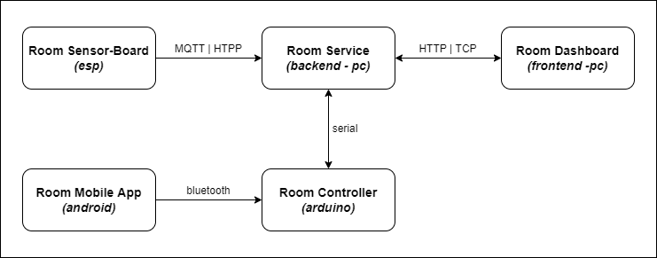

# Project Requirements

## Comportamento automatico

- Se nessuno è nella stanza le luci sono spente
- Se qualcuno entra nella stanza e la stanza è buia le luci si accendono
- Dalle 8 la prima volta che qualcuno entra nella stanza le tapparelle si alzano
- Dalle 19 appena non c'è più nessuno nella stanza le tapparelle si abbassano (tra le 19 e le 8 non entra nessuno)

## Applicazione mobile

- Possibile accendere e spegnere le luci
- Possibile alzare e abbassare le tapparelle (da 0 a 100%)

## Dashboard web

- Possibile accendere e spegnere le luci
- Possibile alzare e abbassare le tapparelle (da 0 a 100%)
- Mostrare lo stato delle luci e delle tapparelle attuale e delle ultime 24 ore

## Comportamento hardware

### Esp

- Il led verde è acceso se c'è qualcuno nella stanza

### Arduino

- Il servo motore è aperto dell'apertura delle tapparelle
- Il led verde è acceso se le luci sono accese
